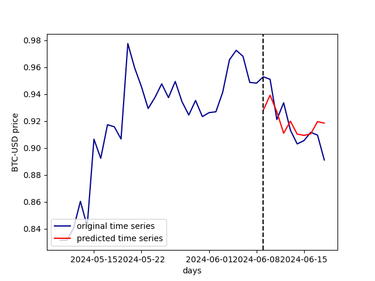
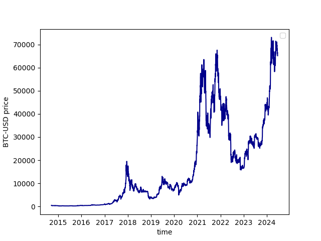
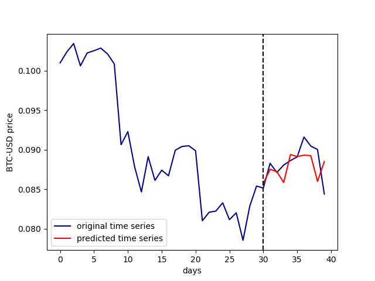

# Recurrent Neural Network - Time Series Forecasting
This project is a simple general time series forecaster with LSTM Recurrent Neural Network, implemented with [Tensorflow](https://www.tensorflow.org/).

<div style='display: flex; justify-content: center; align-items: center;'>
  </img>
</div>

For demonstration purposes, i used the model to predict the bitcoin close prices for the next 10 days, based on the prices of the last 30 days.

## Creating the model
Start by defining the `history_size` and `prediction_size` parameters. They will define the size of the past window, used as input of the model, and the size of the future window, the output of the model.

```python
history_size = 30
prediction_size = 10
```

Then, create the forecaster object 

```python
# instantiate the Forecaster
forecaster = Forecaster(
    data=btc_data,
    history_size=history_size,
    prediction_size=prediction_size
)
```

and define its architecture.

```python
# set the architecture
model_architecture = Sequential([
    Input(shape=(history_size, 1)),
    # ...
    # your layers
    # ...
    Dense(prediction_size)
])
```

Then, build and compile the model.
```python
forecaster.build_model(history_size, prediction_size, model_architecture)
forecaster.compile_model()
```

## Training the model
For training the model, you need a time series to train the **RNN**. You can pass the dataset directly to the `forecaster` in the instantiation or you can load the data using the `load_data()` function. The input data need to be an `numpy` array.

```python
import pandas as pd
import numpy as np

data = pd.read_csv('my_dataset.csv')
time_series = np.array(data['some feature'])

forecaster.load_data(time_series)
```

For the bitcoin prices predictions, i used the historical data of the BTC-USD with the library `yfinance`.

```python
import yfinance
# downloading the dataset
btc = yfinance.download('BTC-USD', start='2005-01-01', end='2024-06-19')

# selecting the time series of the desired feature
btc_data = np.array(btc['Close'])
```

<div style='display: flex; justify-content: center; align-items: center;'>
  
</div>

```python
# training the model
btc_forecaster.train(epochs=20, batch_size=10, initial_epoch=0)
```

## Forecasting
After training the model, we can predict the time series of the next `n=predict_size` values from the `n=history_size` previous values. In the BTC-USD prices predictions example, we predict the window of the BTC close price for 10 next days

```python
# selecting the past window (last 30 days)
past_window = data[-30:] 

# forecasting (predicting the next 10 days)
future_predicted_window = forecaster.predict(past_window)
```

<div style='display: flex; justify-content: center; align-items: center;'>
  
</div>